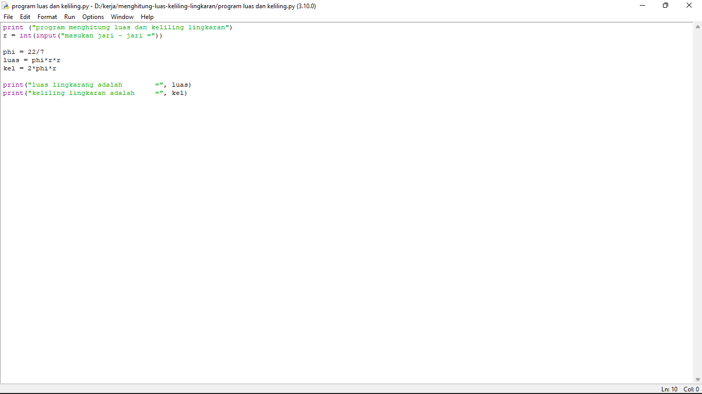
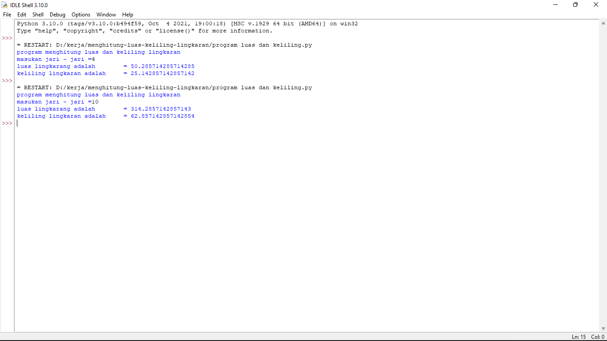

# MENGHITUNG LUAS KELILING LINGKARAN

## Tutorial Menginput Luas Keliling Lingkaran
                                    Buka Pyton Dan Input Data Luas Keliling Lingkaran 
Tampilanya Input Sebagai Berikut 

Klik Run lalu Save : 

Sesudah Mengklik Run Dan Save Maka Hasilnya : 

Flowchrat Menghitung Luas Keliling Lingkarang : 

                                            SEKIAN PENJELASAN DARI SAYA
                                                 SEMOGA BERMANFAAT
                                                   TERIMA KASIH
